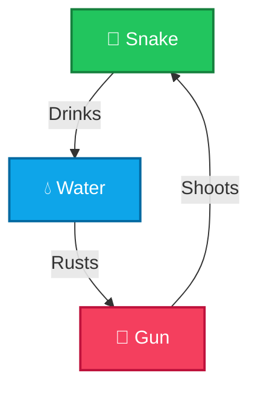

# 🌌 SWG: Element Arena

<p align="center">
  
  
  
  
</p>

<p align="center">
  <strong>An ultra-premium, neon-cyberpunk adaptation of the classic "Snake, Water, Gun" hand game.</strong>
</p>

<p align="center">
  <a href="#-key-features">Key Features</a> •
  <a href="#-game-rules">Game Rules</a> •
  <a href="#-getting-started">Getting Started</a> •
  <a href="#-project-structure">Project Structure</a>
</p>

---

## 🎮 Game Rules

The game rules are imported directly from the core game engine logic:



---

## ⚡ Key Features

### 🗺️ Campaign Mode (Levels 1 - 20)
*   Embark on a level-based run with a dynamic **Levels Selection Grid**.
*   Track progress automatically: cleared levels show checkmarks, active levels pulse, and locked levels are disabled with secure padlocks.

### 🎨 High-Fidelity Vector SVGs
*   **🐍 Cobra Snake:** Detailed cobra hood, fanged jaw lines, glowing red eyes, and a flicking tongue.
*   **🔫 Cyber Railgun:** Futuristic military weapon core glowing with red plasma energy channels.
*   **💧 Splash Wave:** A glassmorphic wave basin with floating droplets and splash crests.

### 💥 Micro-Animations & Visual Showdowns
*   Combat animations trigger dynamically on round showdowns:
    *   *Snake:* Body segments slither and lunge at the opponent.
    *   *Gun:* Shoots flying fireballs and triggers weapon recoil.
    *   *Water:* Translucent rings expand and splash outward.

### 🎹 Synthesizer Audio
*   Custom sound generator built on top of the **Web Audio API** plays interactive synth tones on hovers, buttons clicks, and round results.

### 📊 Persistent Database State
*   User progress and scores (Wins, Losses, Ties) are logged to a SQLite database. Login details are stored with cryptographic password hashing.

---

## 🛠️ Project Structure

```
├── app.py                # Flask Server (API endpoints, database connections)
├── main.py               # Standalone console version & core game rules engine
├── game.db               # SQLite database tracking users and progress levels
├── static/
│   ├── css/
│   │   └── style.css     # Theme stylesheets (3D glows, glassmorphism, animations)
│   └── js/
│       ├── game.js       # SPA client controller, grids renderer & sound manager
│       └── three-scene.js# Interactive Three.js particle system backdrop
└── templates/
    ├── index.html        # Main dashboard and game arena
    ├── login.html        # Secure authorization entrance
    └── register.html     # Account creation screen
```

---

## 🚀 Getting Started

Follow these steps to run the game locally:

### 1. Prerequisites
Ensure you have **Python 3.8+** installed on your system.

### 2. Installation
Clone this repository and navigate to the directory:
```bash
git clone https://github.com/your-username/snake-water-gun-game.git
cd snake-water-gun-game
```

Install the Flask package:
```bash
pip install flask
```

### 3. Initialize & Run
Start the web server:
```bash
python app.py
```
Open your browser and visit **`http://127.0.0.1:5000`** to log in and play!

To play the standalone CLI version in your terminal, run:
```bash
python main.py
```
